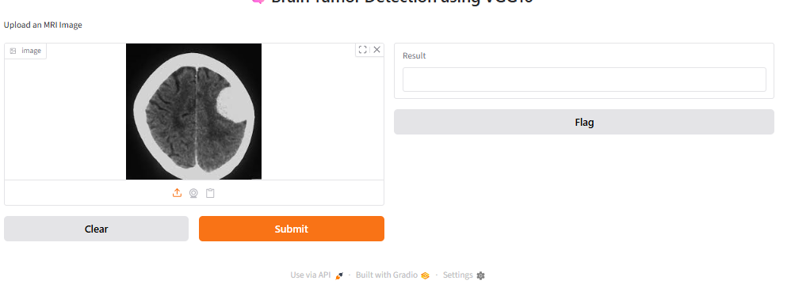
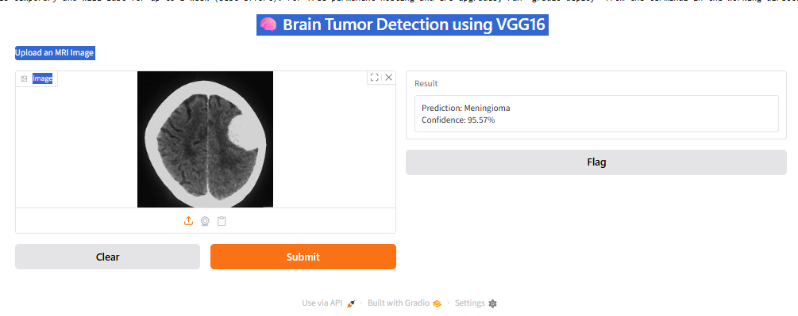

# 🧠 Brain Tumor Detection using VGG16 (Transfer Learning)

A Deep Learning project that classifies brain MRI images into four categories using the **VGG16 Transfer Learning** model built with TensorFlow/Keras.

---

## 📌 Project Overview

This project uses a pre-trained **VGG16** convolutional neural network for Brain Tumor Classification. The model is fine-tuned to classify MRI brain scans into the following classes:

- 🟢 Glioma
- 🔵 Meningioma
- ⚪ No Tumor
- 🟠 Pituitary Tumor

A simple **Gradio** interface is also included for real-time image prediction.

---

## 🚀 Features

- Transfer Learning using VGG16
- MRI Image Classification
- TensorFlow & Keras
- Data Augmentation
- Model Saving & Loading
- Interactive Gradio Web Interface
- Easy Prediction on Custom Images

---

## 🛠️ Technologies Used

- Python
- TensorFlow / Keras
- VGG16 (Pre-trained CNN)
- NumPy
- Matplotlib
- PIL (Python Imaging Library)
- Gradio

---

## 📂 Dataset Structure

```
Dataset/
│
├── Training/
│   ├── Glioma/
│   ├── Meningioma/
│   ├── No Tumor/
│   └── Pituitary/
│
└── Testing/
    ├── Glioma/
    ├── Meningioma/
    ├── No Tumor/
    └── Pituitary/
```

---

## 🧠 Model Architecture

- VGG16 (ImageNet Weights)
- Include Top = False
- Flatten Layer
- Dense Layer (256 Neurons)
- Dropout (0.5)
- Output Layer (4 Classes - Softmax)

---

## 📸 Project Screenshots

### 🔹 Training / Project Start


---

### 🔹 Model Training



---

### 🔹 Prediction Result



---

## ▶️ How to Run

### 1. Clone Repository

```bash
git clone https://github.com/123binodsahu/your-repository-name.git
cd your-repository-name
```

### 2. Install Dependencies

```bash
pip install tensorflow numpy matplotlib pillow gradio
```

### 3. Run the Notebook

Open

```
brain_tumor_(new) (3).ipynb
```

and execute all cells.

---

## 📊 Model Output

The model predicts one of the following classes:

- Glioma
- Meningioma
- No Tumor
- Pituitary

along with the prediction confidence.

---

## 📁 Repository Structure

```
.
├── brain_tumor_(new) (3).ipynb
├── start.png
├── middle.png
├── result.png
├── README.md
```

---

## 🎯 Future Improvements

- Improve Accuracy with Fine-Tuning
- Deploy using Streamlit or Flask
- Add Explainable AI (Grad-CAM)
- Support Batch Predictions
- Docker Deployment

---

## 👨‍💻 Author

**Binod Sahu**

GitHub: https://github.com/123binodsahu

---

## ⭐ If you found this project useful, don't forget to Star ⭐ the repository.
